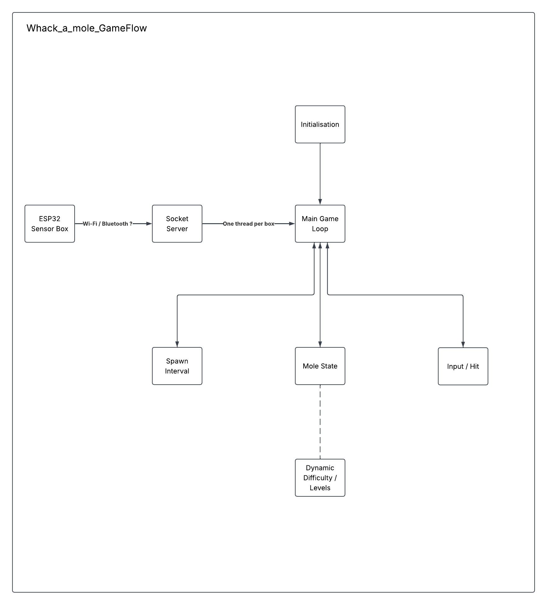

<p align="center">
  <a href="https://choosealicense.com/licenses/mit/">
    
  </a>
  
</p>
<h1 align="center">
  ENGG3000 Group 11 - Whac-a-Mole
</h1>
<p>
  A Whac-a-Mole game built for ENGG3000. Players move through a 1.5 m x 1.4 m grid zone; ultrasonic sensor boxes track position over Bluetooth and drive a Tkinter game on a Windows PC.
</p>

## Table of Contents
- [How to use](#how-to-use)
- [Hardware setup](#hardware-setup)
- [Controls](#controls)
- [How it works](#how-it-works)
- [Troubleshooting](#troubleshooting)
- [Acknowledgements](#acknowledgements)
- [Changelog](#changelog)

## How to use
###### Requires Windows and Python 3. The proximity alarm uses `winsound`, which is Windows-only.

1. Clone the project

```bash
git clone https://github.com/NironR/ENGG3000-2026-G11---Whac-a-Mole.git
```

2. Go to the project directory

```bash
cd ENGG3000-2026-G11---Whac-a-Mole
```

3. Install dependencies

```bash
py -m pip install -r requirements.txt
```

4. Start the game

```bash
py whacka.py
```

Note: In the case where no sensor boxes are connected, the game is able to play via mouse cursor. (Used for debugging/testing)

## Hardware setup
1. **Flash each box.** Open `sensor.ino` in the Arduino IDE with the ESP32 board package (Espressif) installed. Set `#define BOX_ID` to the box's number (1, 2 or 3), then upload. Each box has two RCWL-1601 sensors: sensor 1 on Trig 18 / Echo 5, sensor 2 on Trig 21 / Echo 19.
2. **Pair each box** with the PC in Windows Bluetooth settings. Boxes advertise as `ENGG3000_<BOX_ID>`.
3. **Map the boxes.** `boxes.py` matches each box to its COM port by Bluetooth address, so re-pairing (which changes the COM number) doesn't break anything. It is listed in `.gitignore`, so each machine needs its own copy.
4. **Place the boxes** along the screen wall, one per column. With `MIRROR_BOXES = True` in `whacka.py`, box 1 drives the right-hand column on screen and box 3 the left. If the boxes sit out from the wall, set `BOX_WALL_OFFSET_MM` to that distance.
5. **Check the boxes** before playing:

```bash
py bt_test.py
```

This pings every box 10 times and reports round-trip latency. Pass a port (e.g. `py bt_test.py COM6`) to test just one. `py sensor_view.py` shows a live top-down view of what each box is reading.

## Controls
| Input | Action |
|---|---|
| Move in the play area | Move the hammer (mouse when no boxes are connected) |
| `Esc` | Return to the menu |
| `F11` | Toggle fullscreen |

Stepping within 60 cm of the screen sounds an alarm.

## How it works
- `sensor.ino`: ESP32 firmware. Each box has two RCWL-1601 ultrasonic
  sensors, polled on request over Bluetooth SPP (`ENGG3000_<BOX_ID>`).
  The PC asks one box at a time, so only one sensor is ever listening.
- `whacka.py`: the game. Polls each paired box in turn, picks the
  column from whichever box sees the player, and maps that box's
  distance reading to depth in the grid.
- `boxes.py`: finds each box's COM port from its Bluetooth address.
- `bt_test.py`: bench tool for checking boxes over Bluetooth without
  launching the game.
- `sensor_view.py`: live visualiser of raw box readings, for calibration.
- `BOM.md` — bill of materials and costs.




## Troubleshooting
- **Game prints "pySerial not available" and only the mouse works.** Either `pyserial` isn't installed or `boxes.py` is missing. Both cause the same message.
- **A box keeps resetting when Bluetooth starts.** Open the Arduino serial monitor. `Reset reason: 15 <-- BROWNOUT` means the battery pack is sagging when the radio switches on. Use fresh or fully charged cells.
- **A box never connects.** Re-pair it in Windows Bluetooth settings, then run `py bt_test.py` to confirm it answers.

## Acknowledgements

Credit goes to [CocoonAI](https://github.com/Cocoon-AI/architecture-diagram-generator/tree/main) for constructing the diagram of the run-time for Whac-a-Mole.

## Changelog
### Unreleased
#### Planned
- Packaged `.exe` build of the game.
- One 4xAA NiMH pack per sensor box, to stop brownout resets when Bluetooth starts.
- Firmware: move sensor 1's Echo off GPIO5 (a boot strapping pin), and reduce latency and noise.
- Buffs and debuffs, e.g. a mirrored-controls mole and a hammer-breaking mole that ends the game.
- Music and sound effects.
- Setup and calibration guides.

### 0.3.0 - 2026-10-05
#### Added
- Arcade cabinet visuals, mole sprites with rise and hit animations, and a tracked hammer.
- Reaction-time and combo-based scoring, round timer and score HUD.
- Persistent leaderboard.

#### Changed
- Improved sensor responsiveness, firmware and difficulty tuning.

### 0.2.0 - 2026-09-28
#### Added
- Multi-box communication with the sensor boxes over Bluetooth.

### 0.1.0 - 2026-08-11
#### Added
- Primitive sensor box communication and game.
