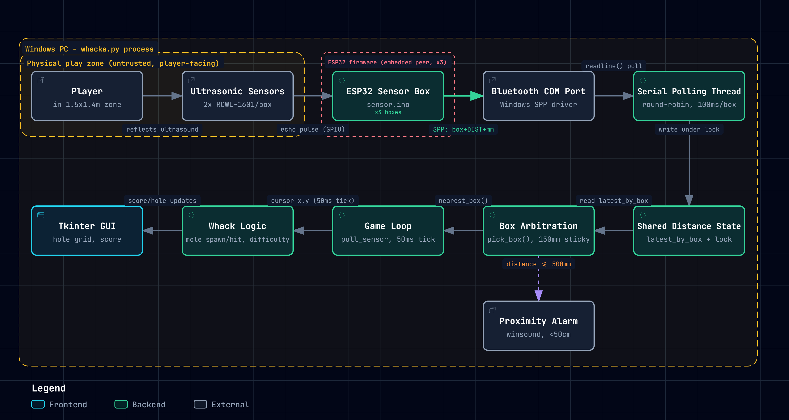

<p align="center">
  <a href="https://choosealicense.com/licenses/mit/">
    
  </a>
  
</p>
<h1 align="center">
  ENGG3000 Group 11 - Whack'a Mole
</h1>
<p>
  A Whac-a-Mole game built for ENGG3000. Players move through a 1.5 m x 1.4 m grid zone; ultrasonic sensor boxes track position over Bluetooth and drive a Tkinter game on a Windows PC.
</p>

## Table of Contents
- [How to use](#how-to-use)
- [How it works](#how-it-works)
- [Acknowledgements](#acknowledgements)
- [Changelog](#changelog)

## How to use
###### To clone and run this application, you'll need to pip install Python ver. 3 or later.

1. Clone the project

```bash
  git clone https://github.com/NironR/ENGG3000-2026-G11---Whac-a-Mole.git
```

2. Go to the project directory

```bash
  cd whacka.py
```

3. Install dependencies

###### Windows
```bash
py -m pip install
```

###### Mac/Linux
```terminal
python3 -m pip install
```

4. Start the game
```bash
Whack-a-Mole.exe

```

## How it works
- `sensor.ino`, ESP32 firmware. Each box has two RCWL-1601 ultrasonic
  sensors, polled on request over Bluetooth SPP (`ENGG3000_<BOX_ID>`).
  The PC asks one box at a time, so only one sensor is ever listening.
- `whacka.py` — the game. Polls each paired box in turn, picks the
  column from whichever box sees the player, and maps that box's
  distance reading to depth in the grid.
- `bt_test.py` — bench tool for testing one box over Bluetooth without
  launching the game.




## Acknowledgements

Credit goes to  for constructing the diagram of the run-time for Whack'a Mole.

## Changelog
## - 28/09/26
- Multi-box Communications with Sensor utilising BT & Wi-Fi.

## - 11/08/26
### Added
- Primitive Sensor Box Communications & Game.


